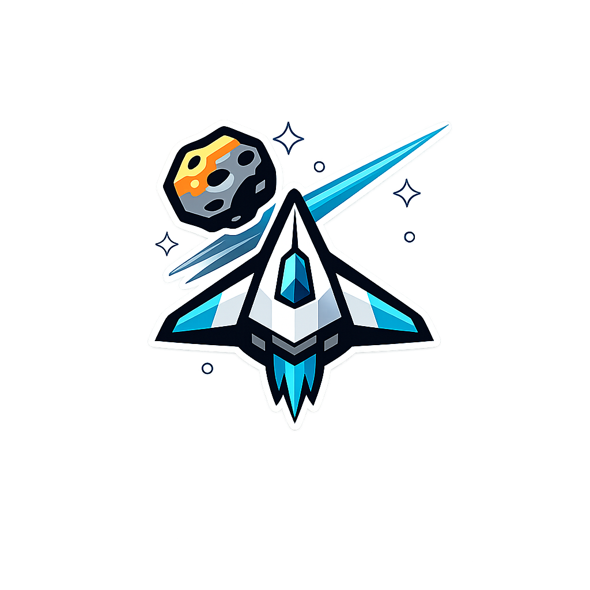
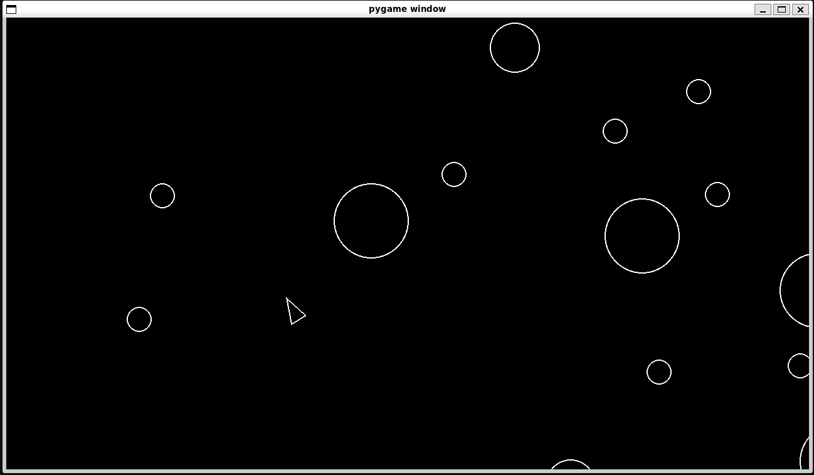

<p align="center">
  
</p>

<h1 align="center">Asteroids</h1>

<p align="center">
  A recreation of the classic Asteroids arcade game built with Python and Pygame as part of the Boot.dev Backend curriculum.
</p>

## Tech Stack

- **Python**
- **Pygame**
- **uv** for dependency and environment management
- **Object-oriented programming**

## Features

- Ship movement and rotation
- Projectile system
- Asteroid spawning
- Collision detection
- Asteroid splitting
- Object-oriented architecture

## Screenshot

<p align="center">
  
</p>

## How to Run

### Prerequisites

- Python 3.12 or newer
- [uv](https://docs.astral.sh/uv/)

### Installation

Clone the repository:

```bash
git clone https://github.com/antonisloukis/asteroids.git
cd asteroids
```

Install the dependencies:

```bash
uv sync
```

Run the game:

```bash
uv run main.py
```
